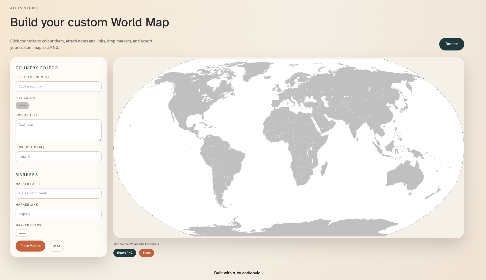

# Maps 🌍

Maps is a web app for building and sharing interactive world maps. Users can colour countries, add labels and links, drop markers, export a PNG, and generate shareable URLs for quick distribution.



## What it does

- Customize country colours and popups on a world map
- Add markers with labels, colours, and links
- Export the map as an image
- Share a generated URL or send via email/Telegram/WhatsApp

## Tech stack

- Next.js (App Router) + React
- TypeScript
- CSS modules/global styles
- SVG-based map rendering

## Development

```bash
npm run dev
```

Then open http://localhost:3000.
